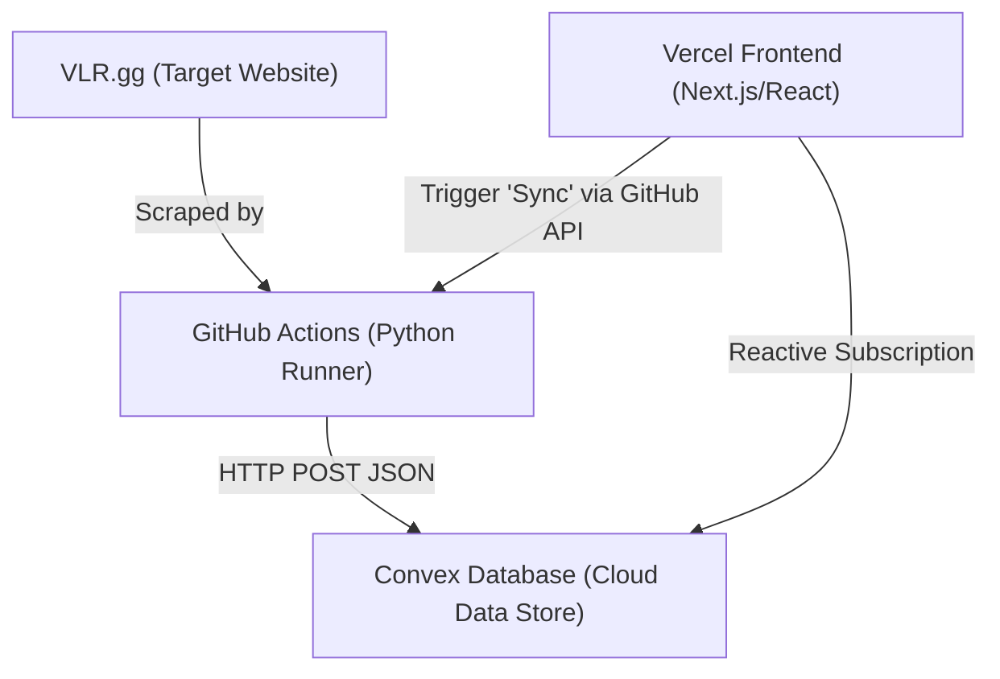

# Migration Guide: Local Flask/SQLite to Vercel + Convex + GitHub Actions

This guide outlines the step-by-step process of migrating the local WWE/VLR Match Tracker project into a modern, 100% free cloud-hosted architecture.



---

## Architecture Components

1. **Frontend (Vercel):** Hosts a Next.js (React) application. React hooks live-subscribe to Convex database queries.
2. **Database (Convex):** Stores matches, team whitelist/blacklist settings, and custom color configuration. Updates are sent instantly to Vercel.
3. **Scraper (GitHub Actions):** A scheduled Python runner that scrapes VLR.gg and writes data to Convex via secure HTTP endpoints or the Convex SDK.

---

## Step 1: Set up the Convex Database

### 1. Initialize Convex
Install the Convex CLI inside a new front-end directory:
```bash
npm install -g convex
npx convex dev
```

### 2. Define the Schema (`convex/schema.ts`)
Map the existing SQLite tables to Convex document types:
```typescript
import { defineSchema, defineTable } from "convex/server";
import { v } from "convex/values";

export default defineSchema({
  matches: defineTable({
    id: v.string(), // VLR match ID
    href: v.string(),
    date: v.string(),
    time: v.string(),
    team1: v.string(),
    team2: v.string(),
    score1: v.string(),
    score2: v.string(),
    tournament: v.string(),
    series: v.string(),
    tournament_logo: v.optional(v.string()),
    status: v.string(),
    team1_logo: v.optional(v.string()),
    team2_logo: v.optional(v.string()),
    unix_timestamp: v.number(),
  }).index("by_match_id", ["id"]),

  settings: defineTable({
    key: v.string(), // e.g. "global"
    unchecked_tournaments: v.array(v.string()),
    white_logo_teams: v.array(v.string()),
    tournament_colors: v.any(), // Key-value object mapping tourneys to hex colors
    thr_show_all_tournaments: v.boolean(),
  }),
});
```

### 3. Create Database Functions (`convex/matches.ts`)
Define mutations for inserting matches and queries for fetching them:
```typescript
import { mutation, query } from "./_generated/server";
import { v } from "convex/values";

export const saveBulkMatches = mutation({
  args: { matches: v.array(v.any()) },
  handler: async (ctx, args) => {
    for (const match of args.matches) {
      const existing = await ctx.db
        .query("matches")
        .withIndex("by_match_id", (q) => q.eq("id", match.id))
        .unique();

      if (existing) {
        await ctx.db.patch(existing._id, match);
      } else {
        await ctx.db.insert("matches", match);
      }
    }
  },
});

export const getMatches = query({
  handler: async (ctx) => {
    return await ctx.db.query("matches").collect();
  },
});
```

---

## Step 2: Adapt the Python Scraper

Instead of writing directly to `sqlite3`, configure the scraper to push data to Convex via a **Convex HTTP Action** or Python `requests`.

### 1. Define HTTP endpoint in Convex (`convex/http.ts`)
Create a route to receive scraped matches:
```typescript
import { httpRouter } from "convex/server";
import { httpAction } from "./_generated/server";
import { api } from "./_generated/api";

const router = httpRouter();

router.route({
  path: "/import-matches",
  method: "POST",
  handler: httpAction(async (ctx, request) => {
    const { matches } = await request.json();
    await ctx.runMutation(api.matches.saveBulkMatches, { matches });
    return new Response(null, { status: 200 });
  }),
});

export default router;
```

### 2. Modify `scraper.py` database calls
Change the SQLite writer to a JSON POST request:
```python
import requests

def upload_to_convex(matches_list):
    url = "https://your-convex-deployment.convex.site/import-matches"
    headers = {"Content-Type": "application/json"}
    payload = {"matches": matches_list}
    
    response = requests.post(url, json=payload)
    if response.status_code == 200:
        print("Scraped matches uploaded successfully to Convex!")
    else:
        print("Upload failed:", response.text)
```

---

## Step 3: Configure GitHub Actions Runner

Create a workflow file in `.github/workflows/scraper.yml` to execute the Python script on a schedule:

```yaml
name: Scheduled Match Scraper

on:
  schedule:
    - cron: '0 * * * *' # Runs every hour
  workflow_dispatch: # Allows manual trigger from the web app

jobs:
  scrape:
    runs-on: ubuntu-latest
    steps:
      - name: Checkout Code
        uses: actions/checkout@v3

      - name: Setup Python
        uses: actions/setup-python@v4
        with:
          python-version: '3.10'

      - name: Install dependencies
        run: |
          pip install -r requirements.txt

      - name: Run Scraper
        env:
          CONVEX_IMPORT_URL: ${{ secrets.CONVEX_IMPORT_URL }}
        run: |
          python scraper.py
```

---

## Step 4: Web App UI Migration (Vercel)

### 1. Build UI using React/Next.js
Using Convex React hooks, matches update automatically without manual fetching:
```javascript
import { useQuery } from "convex/react";
import { api } from "../convex/_generated/api";

export default function MatchGrid() {
  const matches = useQuery(api.matches.getMatches);

  if (!matches) return <div>Loading live matches...</div>;

  return (
    <div className="grid">
      {matches.map(match => (
        <MatchCard key={match.id} match={match} />
      ))}
    </div>
  );
}
```

### 2. Implementing the "Sync Now" Button
Create a Vercel Serverless Function to call GitHub's Trigger API when clicked:
```typescript
// pages/api/sync.ts
import { Octokit } from "@octokit/core";

export default async function handler(req: any, res: any) {
  const octokit = new Octokit({ auth: process.env.GITHUB_PAT });

  await octokit.request('POST /repos/{owner}/{repo}/actions/workflows/{workflow_id}/dispatches', {
    owner: 'your-username',
    repo: 'your-repository',
    workflow_id: 'scraper.yml',
    ref: 'main',
  });

  return res.status(200).json({ status: "Sync initiated" });
}
```

---

## Step 5: Setup Cloud Secrets & Deploy
1. **GitHub Secrets:** Add `CONVEX_IMPORT_URL` (your HTTP endpoint deployment url) to repository secrets.
2. **Vercel Env Variables:** Add `GITHUB_PAT` (Personal Access Token with workflow permissions) and Convex credentials to Vercel configuration.
3. Deploy to Vercel in 1-click.
